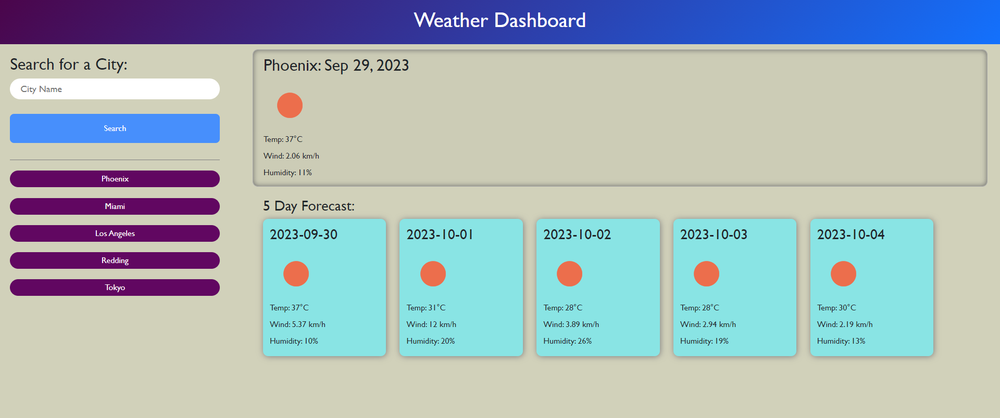

# weather-dashboard

## Description 

This project is a weather dashboard that provide updates on the weather based on the city you searched up.  The goal was develop a practical and user-friendly weather dashboard that provides real-time weather updates for users.  This web application allows users to input their desired city, fetch weather information through the OpenWeatherMap API, and dynamically display this data on the dashboard.

Through this project, I learned the intricacies of working with third-party APIs, making API requests, handling JSON responses, and dynamically updating HTML and CSS elements. I gained a deep understanding of asynchronous JavaScript, enabling real-time data retrieval without having to refresh the entire webpage. Additionally, this project enhanced my skills in creating responsive and visually appealing user interfaces, making complex weather data accessible and understandable to users. Thus, it significantly contributed to my expertise in web development and API integration.

## Website URL

[My Weather Dashboard](https://1ncarnat10n.github.io/weather-dashboard/)

## Installation

No extra programs were required for this challenge.

## Usage

The following image shows the dashboard's appearance and functionality:

## Credits

N/A

## License

N/A

